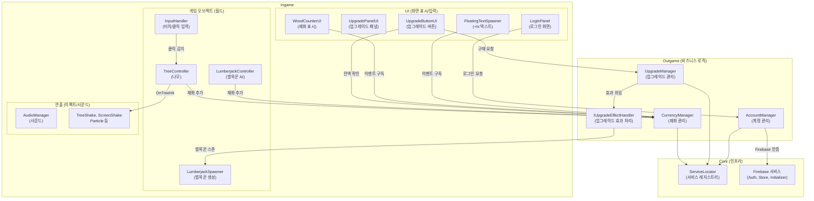
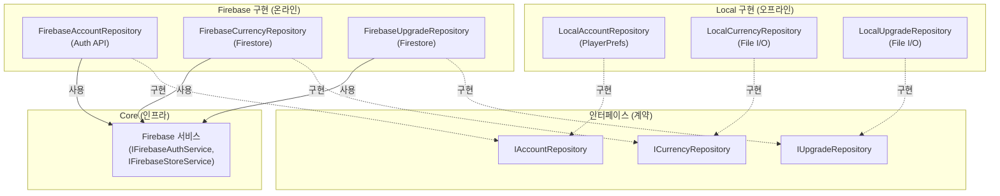
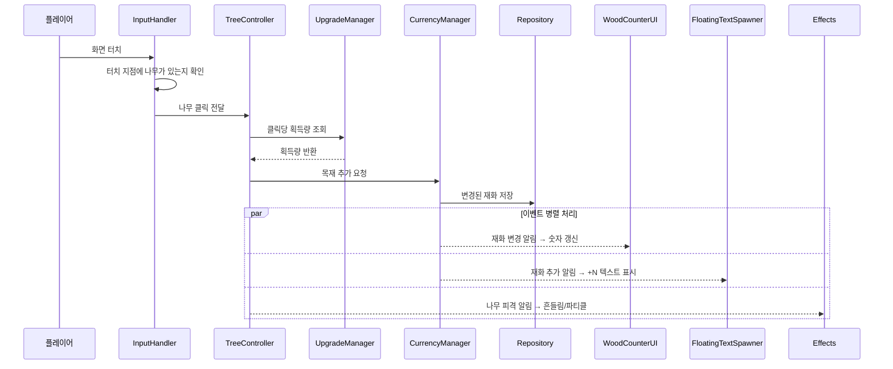
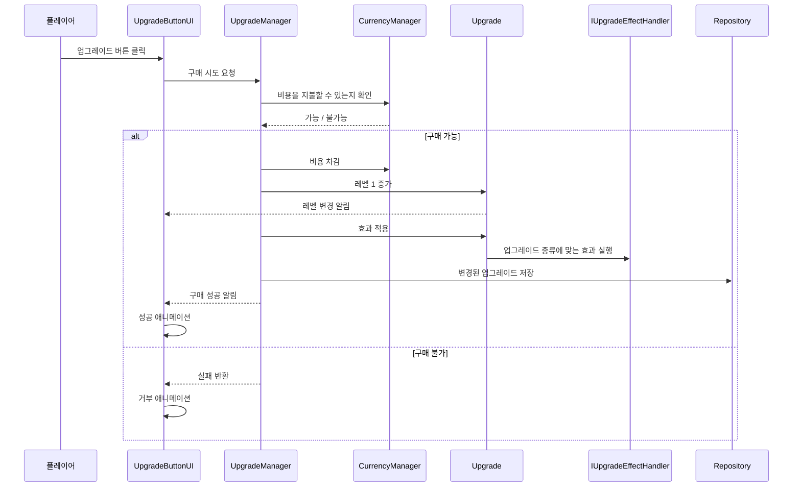
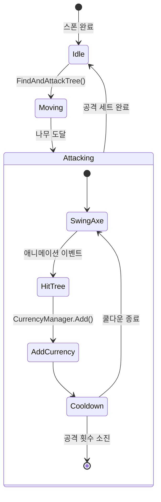
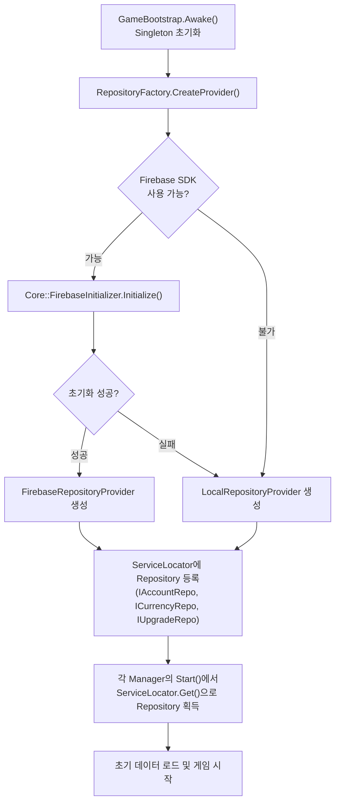

# 벌목왕 - 아키텍처 다이어그램 (요약본)

> `README.md`의 다이어그램을 핵심 위주로 정리한 버전입니다.
> 클래스명 옆 괄호는 해당 클래스의 역할 설명입니다.

---

## 1. 시스템 레이어 구조

게임 코드는 3개 레이어로 나뉘고, 각 레이어는 명확한 역할을 갖습니다.

```
┌──────────────────────┐     ┌──────────────────────────┐
│       Ingame         │ ←─→ │        Outgame           │
│                      │     │                          │
│  플레이어가 직접 보고  │     │  화면 뒤에서 돌아가는     │
│  상호작용하는 영역     │     │  비즈니스 로직 영역       │
│  (나무, 벌목꾼, UI,   │     │  (계정, 재화, 업그레이드)  │
│   사운드, 이펙트)     │     │                          │
└──────────┬───────────┘     └────────────┬─────────────┘
           │                              │
           └──────────┬───────────────────┘
                      ▼
         ┌─────────────────────────┐
         │          Core           │
         │                         │
         │  모두가 공유하는 인프라    │
         │  (ServiceLocator, 암호화, │
         │   Firebase, 공통 인터페이스)│
         └─────────────────────────┘
```

**의존성 규칙**:
- Ingame ↔ Outgame: 양방향 가능 (서로 협력)
- Ingame/Outgame → Core: **단방향만 허용** (Core를 가져다 쓸 수만 있음)

---

## 2. 주요 컴포넌트 의존성



**화살표 = 의존 방향**: A → B는 "A가 B를 사용한다"는 의미.
실선(─) = 직접 참조, 점선(- -) = 인터페이스를 통한 간접 참조.

---

## 3. Repository 패턴 — 저장소 추상화

데이터 저장 방식(Local / Firebase)을 인터페이스로 추상화해서, 어떤 저장소든 같은 방식으로 사용할 수 있게 합니다.



Manager들은 인터페이스(I~Repository)만 알고, 실제 구현이 Local인지 Firebase인지 모릅니다.
덕분에 저장소 교체 시 Manager 코드를 건드릴 필요가 없습니다.

---

## 4. 나무 클릭 → 재화 획득 흐름



핵심 포인트:
- **이벤트 기반 통신**: CurrencyManager가 직접 UI를 호출하지 않고, 이벤트를 발행(점선 화살표)하면 구독자들이 각자 반응
- **par 블록**: 이벤트 구독자들이 동시에 독립적으로 반응하는 구간

---

## 5. 업그레이드 구매 흐름



**Strategy 패턴**: 업그레이드 종류마다 다른 효과를 IUpgradeEffectHandler 구현체로 분리

| 핸들러 | 하는 일 |
|---|---|
| WoodPerClickEffectHandler | 클릭당 목재 보너스 증가 |
| LumberjackProductionEffectHandler | 벌목꾼 1명당 생산량 증가 |
| SpawnLumberjackEffectHandler | 새 벌목꾼 스폰 |

---

## 6. 벌목꾼 AI 상태 머신



벌목꾼은 **Idle → Moving → Attacking** 3개 상태를 순환합니다.
Attacking 내부에서는 "휘두르기 → 적중 → 재화 추가 → 쿨다운"을 반복합니다.

---

## 7. 앱 부팅 시퀀스



부팅 순서 요약:
1. `GameBootstrap.Awake()` — 앱 진입점, Singleton 보장
2. `RepositoryFactory` — Firebase 가능 여부에 따라 저장소 구현체 결정
3. `ServiceLocator` — 결정된 Repository를 전역 레지스트리에 등록
4. 각 Manager — `Start()`에서 ServiceLocator를 통해 Repository를 가져와 초기화
