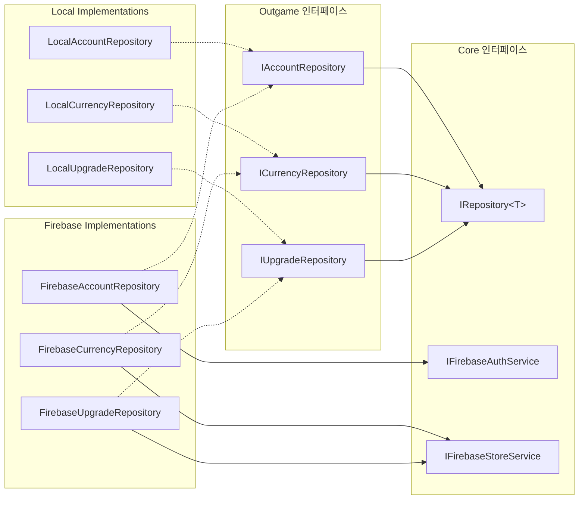
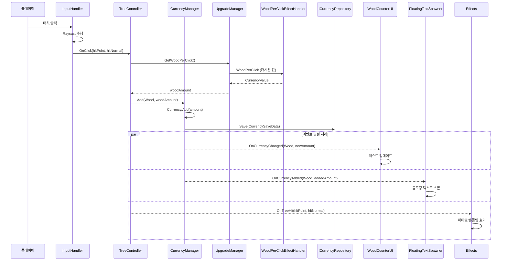
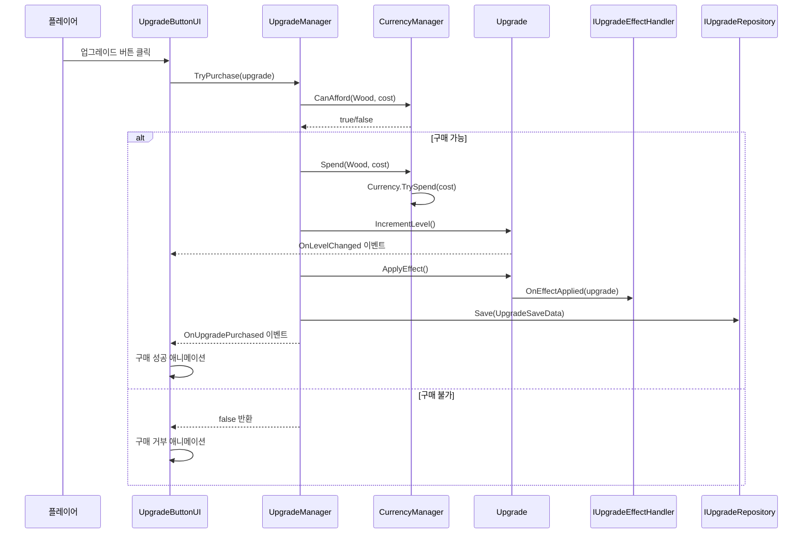
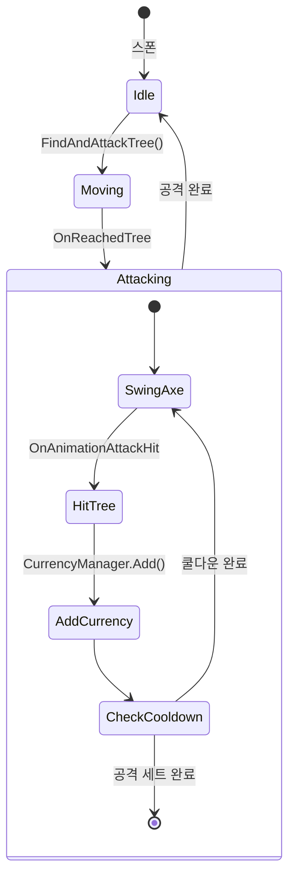
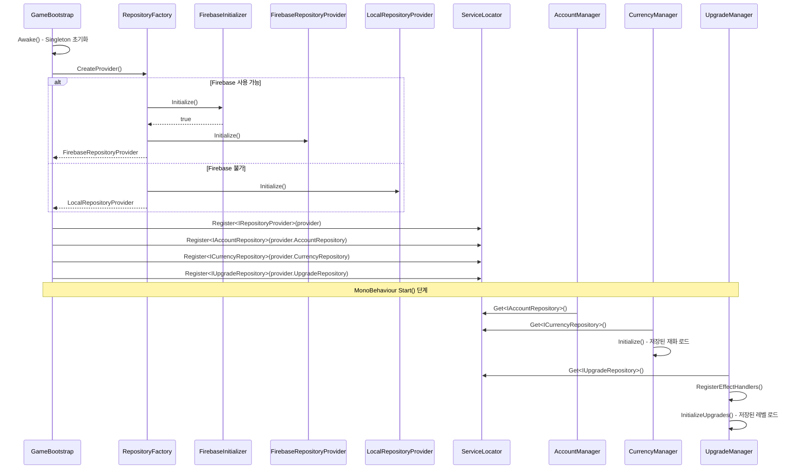
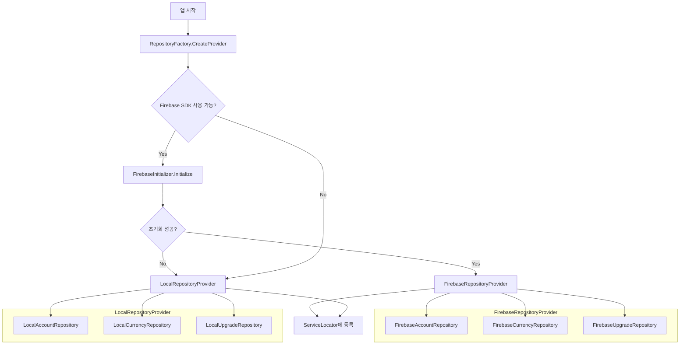

    # 벌목왕 (Lumber Tycoon) - 시스템 아키텍처 문서

## 목차

1. [시스템 개요](#시스템-개요)
2. [모듈 구조](#모듈-구조)
3. [의존성 방향 다이어그램](#의존성-방향-다이어그램)
4. [데이터 흐름 다이어그램](#데이터-흐름-다이어그램)
5. [핵심 디자인 패턴](#핵심-디자인-패턴)
6. [부팅 시퀀스](#부팅-시퀀스)
7. [모듈별 상세 문서](#모듈별-상세-문서)

---

## 시스템 개요

벌목왕은 도메인 분류 기반 아키텍처를 따릅니다. Ingame과 Outgame은 양방향 협력 관계이며, Core는 인프라 레이어로 단방향 의존만 허용됩니다.

```
┌──────────────────────┐     ┌──────────────────────────┐
│        Ingame        │ ←─→ │         Outgame          │
│  (게임플레이, UI,     │     │  (비즈니스 도메인:        │
│   이펙트)            │     │   계정, 재화, 업그레이드)  │
└──────────┬───────────┘     └────────────┬─────────────┘
           │                              │
           └──────────┬───────────────────┘
                      ▼
         ┌─────────────────────────┐
         │          Core           │
         │  (인프라: DI, 유틸리티)   │
         └─────────────────────────┘
```

**의존성 규칙**:
- `Ingame ←→ Outgame`: 양방향 허용 (도메인 영역 분류)
- `Ingame/Outgame → Core`: 단방향만 허용 (인프라 레이어)

---

## 모듈 구조

```
Assets/02.Scripts/
├── GameBootstrap.cs          # Composition Root (글로벌 namespace)
│
├── Core/                     # 인프라 레이어 (namespace: Core)
│   ├── Common/               # 공통 인프라 (ServiceLocator, Crypto,
│   │                         #   IIdentifiable, IRepository<T>)
│   └── Firebase/             # Firebase 인프라 서비스
│       ├── Domain/           # FirebaseAuthResult
│       └── Service/          # IFirebaseAuthService, IFirebaseStoreService, 구현체
│
├── Outgame/                  # 비즈니스 도메인 레이어 (namespace: Outgame)
│   ├── Common/
│   │   └── Repository/       # IRepositoryProvider, RepositoryFactory, Provider 구현체
│   ├── Account/              # 계정 관리 (인증, 회원가입)
│   ├── Currency/             # 재화 시스템 (Wood)
│   └── Upgrade/              # 업그레이드 시스템
│       ├── Domain/           # 도메인 모델 (Upgrade, UpgradeSpecData)
│       ├── Manager/          # UpgradeManager
│       ├── Effect/           # Strategy 패턴 효과 핸들러
│       └── Repository/       # 저장소 구현
│
└── Ingame/                   # 게임플레이 레이어 (namespace: Ingame)
    ├── Common/Interface/     # IClickable 등 공통 인터페이스
    ├── Player/               # 입력 처리
    ├── Tree/                 # 나무 오브젝트
    ├── Lumberjack/           # 벌목꾼 AI
    ├── Audio/                # 사운드 시스템
    ├── Effect/               # 시각 이펙트
    ├── UI/                   # UI 시스템
    └── Util/                 # ObjectPool, AspectRatioManager
```

---

## 의존성 방향 다이어그램

### 전체 모듈 의존성

```mermaid
graph TB
    subgraph "Composition Root"
        GameBootstrap[GameBootstrap]
    end

    subgraph "Ingame Layer"
        InputHandler[InputHandler]
        TreeController[TreeController]
        LumberjackController[LumberjackController]
        LumberjackSpawner[LumberjackSpawner]
        AudioManager[AudioManager]
        UpgradePanelUI[UpgradePanelUI]
        UpgradeButtonUI[UpgradeButtonUI]
        FloatingTextSpawner[FloatingTextSpawner]
        WoodCounterUI[WoodCounterUI]
        LoginPanel[LoginPanel]
    end

    subgraph "Outgame Layer"
        AccountManager[AccountManager]
        CurrencyManager[CurrencyManager]
        UpgradeManager[UpgradeManager]
        RepositoryFactory[RepositoryFactory]
        IRepositoryProvider[IRepositoryProvider]
        LocalRepoProvider[LocalRepositoryProvider]
        FirebaseRepoProvider[FirebaseRepositoryProvider]
        IUpgradeEffectHandler[IUpgradeEffectHandler]
        WoodPerClickHandler[WoodPerClickEffectHandler]
        LumberjackProductionHandler[LumberjackProductionEffectHandler]
        SpawnLumberjackHandler[SpawnLumberjackEffectHandler]
    end

    subgraph "Core Layer"
        ServiceLocator[ServiceLocator]
        FirebaseInitializer[FirebaseInitializer]
        IFirebaseAuthSvc[IFirebaseAuthService]
        IFirebaseStoreSvc[IFirebaseStoreService]
    end

    %% Composition Root → 전체 참조
    GameBootstrap --> RepositoryFactory
    GameBootstrap --> ServiceLocator
    GameBootstrap --> FirebaseInitializer

    %% Ingame ←→ Outgame (양방향)
    TreeController --> CurrencyManager
    LumberjackController --> CurrencyManager
    UpgradeButtonUI --> UpgradeManager
    UpgradeButtonUI --> CurrencyManager
    UpgradePanelUI --> UpgradeManager
    FloatingTextSpawner --> CurrencyManager
    WoodCounterUI --> CurrencyManager
    LoginPanel --> AccountManager
    SpawnLumberjackHandler --> LumberjackSpawner

    %% Outgame → Core
    AccountManager --> ServiceLocator
    CurrencyManager --> ServiceLocator
    UpgradeManager --> ServiceLocator

    %% Outgame → Core
    RepositoryFactory --> IRepositoryProvider
    FirebaseRepoProvider --> FirebaseInitializer
    FirebaseRepoProvider --> IFirebaseAuthSvc
    FirebaseRepoProvider --> IFirebaseStoreSvc
    LocalRepoProvider -.-> IRepositoryProvider
    FirebaseRepoProvider -.-> IRepositoryProvider

    %% Strategy Pattern
    UpgradeManager --> IUpgradeEffectHandler
    WoodPerClickHandler -.-> IUpgradeEffectHandler
    LumberjackProductionHandler -.-> IUpgradeEffectHandler
    SpawnLumberjackHandler -.-> IUpgradeEffectHandler
```



### Repository 패턴 의존성



---

## 데이터 흐름 다이어그램

### 나무 클릭 → 재화 획득 흐름



### 업그레이드 구매 흐름



### 벌목꾼 AI 상태 흐름



### 앱 부팅 시퀀스



### 데이터 저장소 선택 흐름



---

## 핵심 디자인 패턴

### 1. Service Locator

`ServiceLocator`는 정적 서비스 레지스트리로, 인터페이스 기반 의존성 주입을 제공합니다.

```csharp
// 등록 (GameBootstrap에서)
ServiceLocator.Register<ICurrencyRepository>(repository);

// 조회 (Manager에서)
var repo = ServiceLocator.Get<ICurrencyRepository>();
```

**등록되는 서비스**: `IAccountRepository`, `ICurrencyRepository`, `IUpgradeRepository`

### 2. Repository Pattern

데이터 영속성을 추상화하여 Local/Firebase 간 교체를 가능하게 합니다.

| 인터페이스 | Local 구현 | Firebase 구현 |
|---|---|---|
| `IAccountRepository` | `LocalAccountRepository` (PlayerPrefs) | `FirebaseAccountRepository` |
| `ICurrencyRepository` | `LocalCurrencyRepository` (File I/O) | `FirebaseCurrencyRepository` |
| `IUpgradeRepository` | `LocalUpgradeRepository` (File I/O) | `FirebaseUpgradeRepository` |

### 3. Strategy Pattern (업그레이드 효과)

`IUpgradeEffectHandler` 인터페이스를 통해 업그레이드 타입별 효과를 분리합니다.

| 핸들러 | 역할 | 효과 |
|---|---|---|
| `WoodPerClickEffectHandler` | 클릭당 목재 보너스 누적 | `+{amount}` |
| `LumberjackProductionEffectHandler` | 벌목꾼 생산량 보너스 | `+{amount}/벌목꾼` |
| `SpawnLumberjackEffectHandler` | 벌목꾼 고용 (스폰) | `벌목꾼 +1` |

### 4. Object Pool

성능 최적화를 위해 자주 생성/파괴되는 오브젝트를 풀링합니다.

| 풀링 대상 | 사용 위치 |
|---|---|
| `FloatingText` | `FloatingTextSpawner` |
| `Firewood` | `FirewoodSpawner` |
| `ParticleSystem` | `EnhancedParticleSpawner` |
| `AudioSource` | `AudioManager` |

### 5. Event-Driven Communication

컴포넌트 간 결합도를 낮추기 위해 이벤트 기반 통신을 사용합니다.

```
CurrencyManager.OnCurrencyChanged ──→ WoodCounterUI, UpgradeButtonUI
CurrencyManager.OnCurrencyAdded   ──→ FloatingTextSpawner, WoodCounterAnimator
UpgradeManager.OnUpgradePurchased ──→ UpgradeButtonUI
Upgrade.OnLevelChanged            ──→ UpgradeButtonUI
AccountManager.OnLoginSuccess     ──→ LoginPanel
AccountManager.OnAuthError        ──→ LoginPanel, ToastMessage
InputHandler.OnTreeClicked        ──→ TreeController
TreeController.OnTreeHit          ──→ Effects (TreeShake, ScreenShake, Particles)
```

### 6. Value Object (CurrencyValue)

`CurrencyValue`는 불변 값 객체로, 연산자 오버로딩과 형식화된 문자열 출력을 지원합니다.

```csharp
CurrencyValue a = new CurrencyValue(1500);
CurrencyValue b = new CurrencyValue(500);
CurrencyValue result = a + b;          // 2000
string display = result.ToFormattedString(); // "2.0K"
```

**포맷 규칙**: `B` (10억+), `M` (100만+), `K` (1000+), 그 외 정수 표시

---

## 모듈별 상세 문서

- [Core 모듈 API 레퍼런스](./core-module.md)
- [Outgame 모듈 API 레퍼런스](./outgame-module.md)
- [Ingame 모듈 API 레퍼런스](./ingame-module.md)
