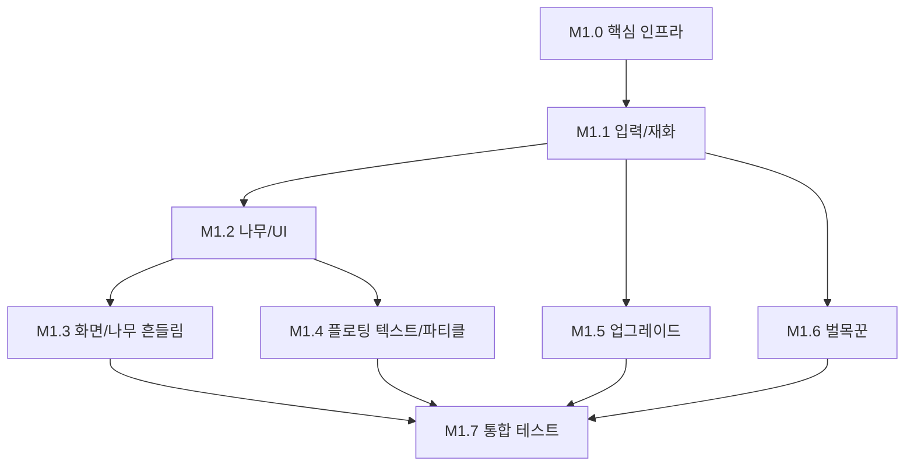

# M1 프로토타입 - 태스크 분리

## 개요

M1 프로토타입 구현을 8개의 작은 태스크로 분리했습니다.
각 태스크는 독립적으로 작업 가능하며, 의존성이 명확히 정의되어 있습니다.

## 태스크 목록

| 순서 | 태스크 ID | 이름 | 스크립트 수 | 의존성 | 상태 |
|------|-----------|------|-------------|--------|------|
| 1 | M1.0 | 프로젝트 구조 및 핵심 인프라 | 5 | 없음 | ✅ |
| 2 | M1.1 | 입력 및 재화 시스템 | 2 | M1.0 | ✅ |
| 3 | M1.2 | 나무 및 기본 UI | 2 | M1.1 | ✅ |
| 4 | M1.3 | 게임 필 - 화면/나무 흔들림 | 2 | M1.2 | ✅ |
| 5 | M1.4 | 게임 필 - 플로팅 텍스트/파티클 | 4 | M1.2 | ✅ |
| 6 | M1.5 | 업그레이드 시스템 | 5 | M1.1 | ✅ |
| 7 | M1.6 | 벌목꾼 시스템 | 2 | M1.1 | ⬜ |
| 8 | M1.7 | 통합 테스트 및 밸런싱 | 0 | M1.0~M1.6 | ⬜ |

## 의존성 그래프



## 병렬 작업 가능 그룹

### Group A (순차적)
1. M1.0 → M1.1 → M1.2 → M1.3

### Group B (M1.2 이후 병렬 가능)
- M1.3 (흔들림)
- M1.4 (플로팅 텍스트/파티클)

### Group C (M1.1 이후 병렬 가능)
- M1.5 (업그레이드)
- M1.6 (벌목꾼)

## 스크립트 배분

### M1.0 - 핵심 인프라 (5개)
- `Core/ServiceLocator.cs`
- `Core/GameEvents.cs`
- `Interfaces/ISaveable.cs`
- `Interfaces/IClickable.cs`
- `Utils/ObjectPool.cs`

### M1.1 - 입력/재화 (2개)
- `Player/InputHandler.cs`
- `Core/GameManager.cs`

### M1.2 - 나무/UI (2개)
- `Tree/TreeController.cs`
- `UI/WoodCounterUI.cs`

### M1.3 - 화면/나무 흔들림 (2개)
- `Effects/ScreenShake.cs`
- `Effects/TreeShake.cs`

### M1.4 - 플로팅 텍스트/파티클 (4개)
- `Effects/FloatingText.cs`
- `Effects/FloatingTextSpawner.cs`
- `Effects/HitParticleSpawner.cs`
- (파티클 프리팹 설정)

### M1.5 - 업그레이드 (5개)
- `Economy/UpgradeData.cs`
- `Economy/UpgradeManager.cs`
- `UI/UpgradeButtonUI.cs`
- `UI/UpgradePanelUI.cs`
- `UI/UpgradePanelToggle.cs`

### M1.6 - 벌목꾼 (2개)
- `Lumberjack/LumberjackController.cs`
- `Lumberjack/LumberjackSpawner.cs`

### M1.7 - 통합 테스트 (0개 신규)
- 전체 시스템 연동 테스트
- 밸런싱 조정

## 총 스크립트: 19개

## 태스크 파일 위치

```
docs/plans/m1-tasks/
├── README.md (이 파일)
├── m1.0-core-infrastructure.md
├── m1.1-input-economy.md
├── m1.2-tree-ui.md
├── m1.3-shake-effects.md
├── m1.4-floating-text-particles.md
├── m1.5-upgrade-system.md
├── m1.6-lumberjack-system.md
└── m1.7-integration-test.md
```

## 진행 방법

1. 태스크를 순서대로 또는 병렬로 작업
2. 각 태스크 완료 시 상태를 ✅로 업데이트
3. M1.7 통합 테스트에서 전체 시스템 검증
