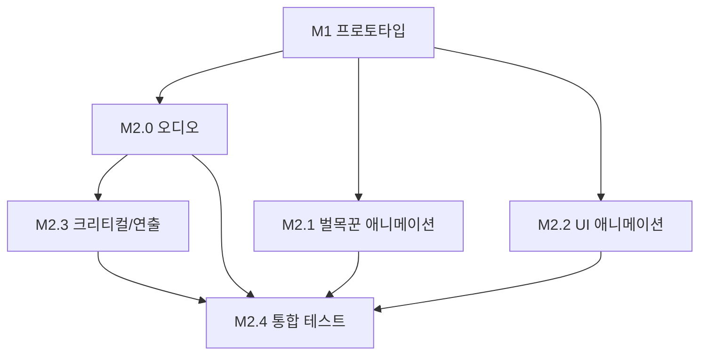

# M2 게임 필 - 태스크 분리

## 개요

M2 게임 필 구현을 5개의 태스크로 분리했습니다.
오디오, 애니메이션, UI 연출, 크리티컬 시스템 등 게임 필 요소에 집중합니다.

## 태스크 목록

| 순서 | 태스크 ID | 이름 | 스크립트 수 | 의존성 | 상태 |
|------|-----------|------|-------------|--------|------|
| 1 | M2.0 | 오디오 시스템 | 4 | M1 | ⬜ |
| 2 | M2.1 | 벌목꾼 애니메이션 & 이펙트 | 3 | M1 | ⬜ |
| 3 | M2.2 | UI 애니메이션 | 5 | M1 | ⬜ |
| 4 | M2.3 | 크리티컬 & 연출 | 4 | M2.0 | ⬜ |
| 5 | M2.4 | 통합 테스트 | 0 | M2.0~M2.3 | ⬜ |

## 의존성 그래프



## 병렬 작업 가능 그룹

### Group A (M1 이후 병렬 가능)
- M2.0 (오디오 시스템)
- M2.1 (벌목꾼 애니메이션)
- M2.2 (UI 애니메이션)

### Group B (M2.0 이후)
- M2.3 (크리티컬 & 연출) - 크리티컬 사운드 필요

### Group C (전체 완료 후)
- M2.4 (통합 테스트)

## 스크립트 배분

### M2.0 - 오디오 시스템 (4개)
- `Audio/AudioManager.cs`
- `Audio/SFXConfig.cs` (ScriptableObject)
- `Audio/BGMController.cs`
- `Audio/AmbientSoundController.cs`

### M2.1 - 벌목꾼 애니메이션 (3개)
- `Lumberjack/LumberjackAnimator.cs`
- `Effects/SpawnEffect.cs`
- `Effects/EnhancedParticleSpawner.cs`

### M2.2 - UI 애니메이션 (5개)
- `UI/WoodCounterAnimator.cs`
- `UI/UpgradeButtonAnimator.cs`
- `UI/FloatingTextAnimator.cs`
- `UI/PanelTransition.cs`
- `UI/ToastMessage.cs`

### M2.3 - 크리티컬 & 연출 (4개)
- `Combat/CriticalSystem.cs`
- `Effects/CriticalEffect.cs`
- `Effects/EvolutionEffect.cs`
- `Effects/LevelUpEffect.cs`

### M2.4 - 통합 테스트 (0개 신규)
- 전체 게임 필 연동 테스트
- 사운드/비주얼 조정

## 총 스크립트: 16개

## 태스크 파일 위치

```
Docs/plans/m2-tasks/
├── README.md (이 파일)
├── m2.0-audio-system.md
├── m2.1-lumberjack-animation.md
├── m2.2-ui-animation.md
├── m2.3-critical-effects.md
└── m2.4-integration-test.md
```

## 진행 방법

1. M2.0, M2.1, M2.2는 병렬로 작업 가능
2. M2.3은 M2.0 완료 후 진행 (크리티컬 사운드 필요)
3. M2.4 통합 테스트에서 전체 게임 필 검증
4. 각 태스크 완료 시 상태를 ✅로 업데이트

## 외부 에셋 의존성

| 에셋 | 필요 시점 | 대체 방안 |
|------|-----------|-----------|
| SFX (타격음 4종+) | M2.0 시작 | 플레이스홀더 사운드 |
| BGM 트랙 | M2.0 시작 | 임시 BGM |
| 벌목꾼 애니메이션 | M2.1 시작 | 프로그래밍 애니메이션 |
